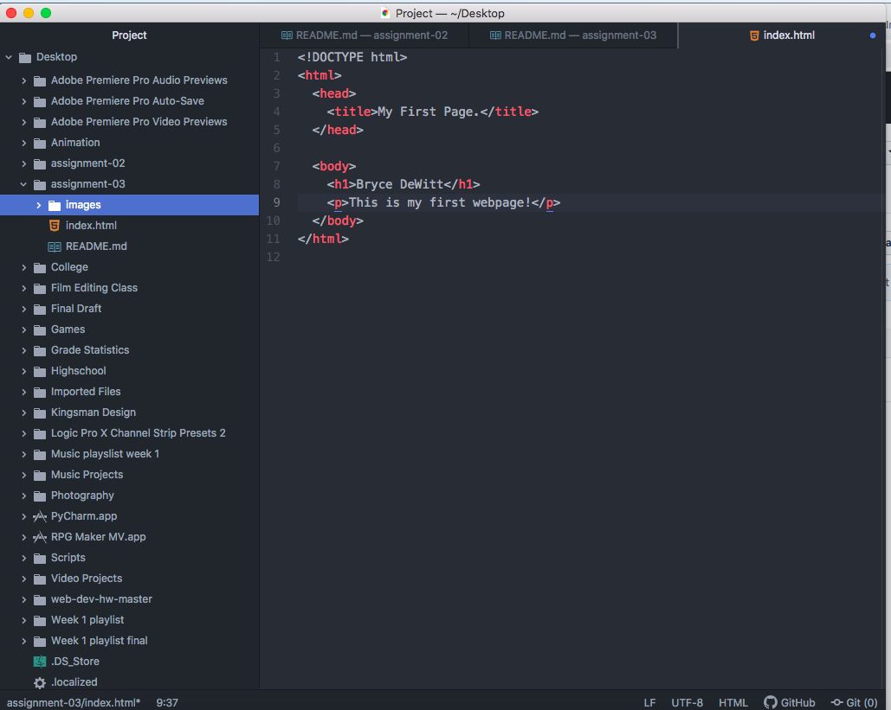

# Assignment 3
# Bryce DeWitt

1. A web browser is used to interact with the world wide web in an easy and user-friendly way. You use a web browser to access certain information that is then retrieved and brought back to your device. This is usually in the form of a markup language.

2. Markup language is a language used by computers in the form of tags. This is different from straight machine language however, as it is readable by humans. HTML is the most common markup language for web development alongside CSS.

